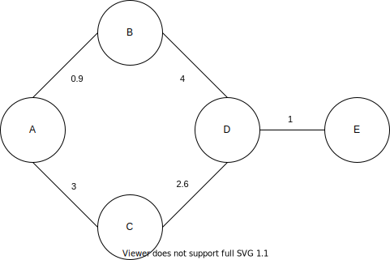
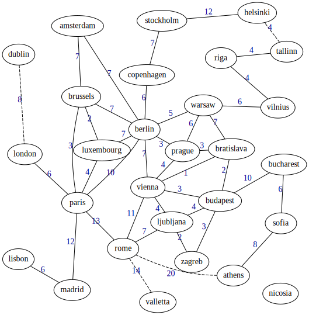

# Weighted graph analysis

  - [1. Introduction](#1-introduction)
  - [2. Compilation](#2-compilation)
  - [3. Usage](#3-usage)
    - [3.1. help](#31-help)
    - [3.2. number](#32-number)
    - [3.3. vertices](#33-vertices)
    - [3.4. path](#34-path)
    - [3.5. diameter](#35-diameter)
    - [3.6. degree](#36-degree)
    - [3.7. betweenness](#37-betweenness)
  - [4. Examples](#4-examples)
    - [4.1. Simple graph](#41-simple-graph)
    - [4.2. European cities](#42-european-cities)

## 1. Introduction

This is a small CLI application which performs some operations over a weighted graph, such as:
- Number of vertices (nodes)
- Number of edges
- List all vertices
- Shortest path between two vertices
- Graph diameter
- Vertex with maximum degree centrality
- Vertex with maximum betweenness centrality

Developed by Mario Simão for the Programming Languages class, during the Computer and Electronic Engineering course at the Federal University of Rio de Janeiro (UFRJ).

## 2. Compilation

```bash
$ make all
```

## 3. Usage

```bash
$ ./graph <command> [<args>]
```

The available commands are listed below.

### 3.1. help

Displays information about all commands.

```bash
$ ./graph help
```

### 3.2. number

Number of edges and vertices.

```bash
$ ./graph number <filename>
```

### 3.3. vertices

List all vertices.

```bash
$ ./graph vertices <filename>
```

### 3.4. path

Shortest path between source and target vertices

```bash
$ ./graph vertices <filename> <source> <target>
```

### 3.5. diameter

Graph diameter (longest path between all shortest paths).

```bash
$ ./graph diameter <filename>
```

### 3.6. degree

Vertex with maximum degree centrality.

```bash
$ ./graph diameter <filename>
```

### 3.7. betweenness

Vertex with maximum betweenness centrality.

```bash
$ ./graph betweenness <filename>
```

## 4. Examples

This program only supports CSV files where rows represent edges. Each edge is formed by the vertices names and a weight.

### 4.1. Simple graph

To represent the following graph



the CSV file would be:

```csv
A,B,0.9
A,C,3
B,D,4
C,D,2.6
D,E,1
```

This example is already on this repository (see `simple.csv`).

To find the shortest path between A and E, execute

```bash
$ ./graph path simple.csv A E
```

and the program should return

```
Shortest path between 'A' and 'E'

Distance: 5.9
    Path: E <- D <- B <- A
```

### 4.2. European cities

This repository also includes an example of European cities and the driving distances in hours between them. See `europe.csv`.



To find longest path among the all possible shortest paths, execute:

```bash
$ ./graph diameter europe.csv
```

And the result would be from Lisbon to Sofia!

```
Graph diameter: longest path among the shortest paths between all vertices

Distance: 52
    Path: sofia <- bucharest <- budapest <- bratislava <- prague <- berlin <- paris <- madrid <- lisbon
```
